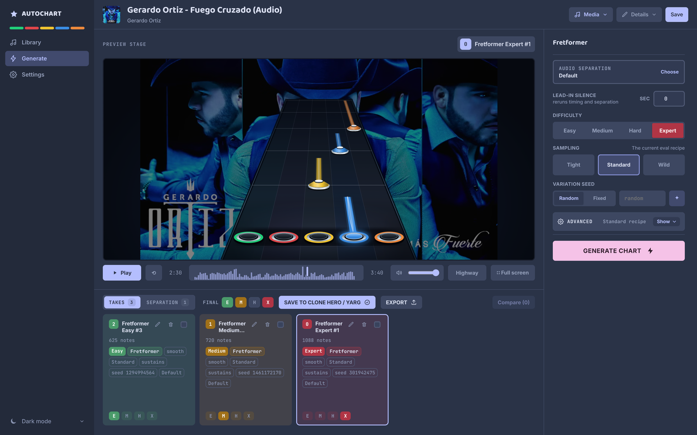
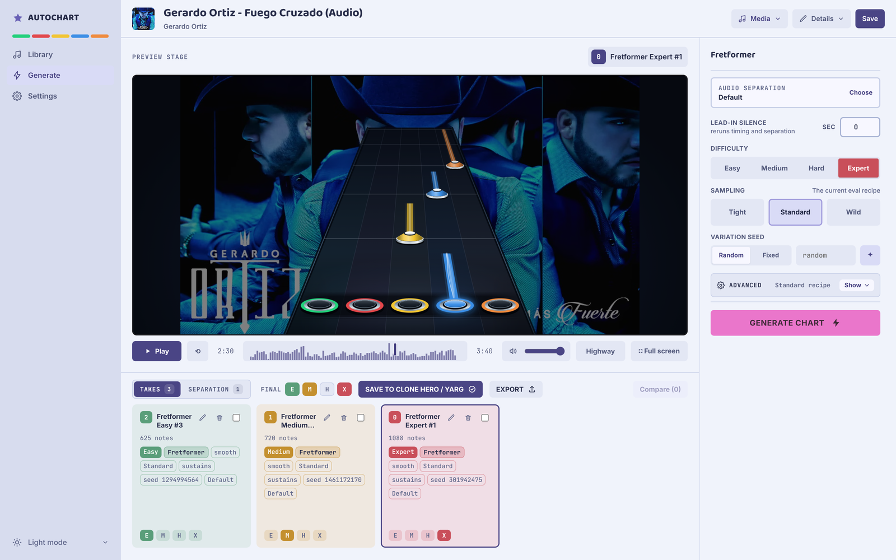
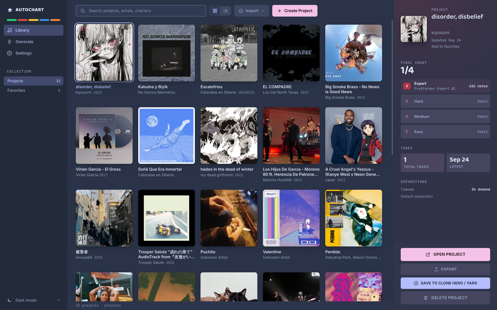
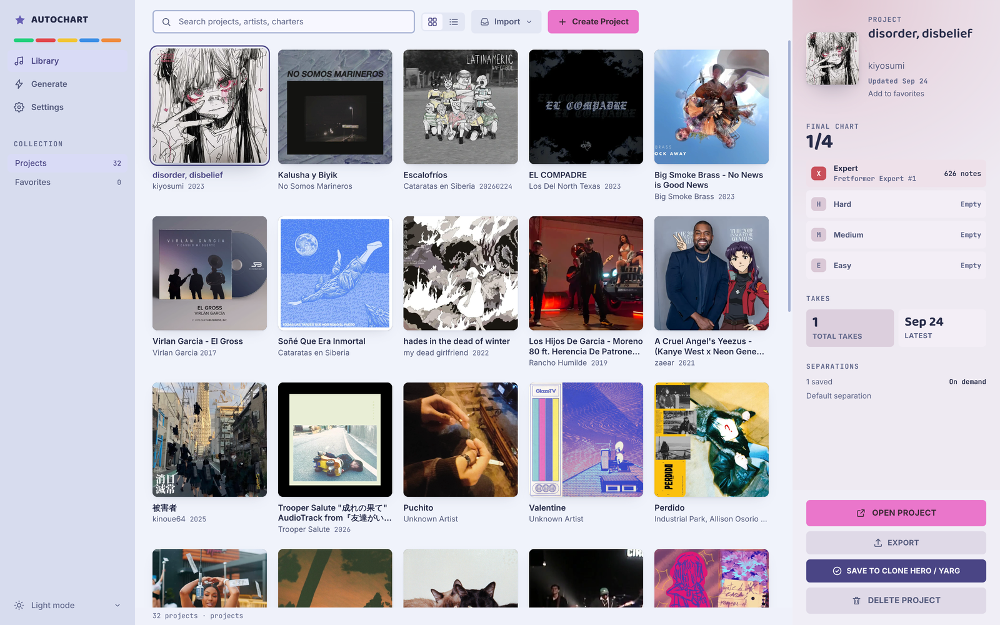

<p align="center">
  
</p>

<h1 align="center">Autochart</h1>

<p align="center">
  Make guitar charts for YARG and Clone Hero from any song.<br>
  Free, and it runs on your own computer.
</p>

<p align="center">
  
  
  <br>
  
  
</p>

Import a song, pick a difficulty, and Autochart's model writes a five-fret
guitar chart while you watch. Keep the takes you like, fix notes, and export a
song folder ready to play. Already have a chart that's only on Expert? Import it
and generate the difficulties it's missing.

- **Generate from audio** at Easy, Medium, Hard, or Expert
- **Fill in missing difficulties** on an existing `.chart` song, using its original timing
- **Compare takes and edit notes** before you export
- **Keep a library** with album art and image or video backgrounds
- **Stays on your computer.** No account, no uploads, works offline after setup

> [!NOTE]
> Autochart is in beta. Download it from the [Releases](../../releases) page.

## Download

| System | File |
| --- | --- |
| Windows (x64) | `.exe` installer, or portable `.zip` |
| macOS (Apple Silicon) | `.dmg` |
| Linux (x64) | `.AppImage` |

On first launch, Autochart downloads its model (about 700 MB). No Python or
accounts needed. Intel Macs and ARM versions of Windows and Linux aren't
supported.

The builds aren't signed, so your system may warn you the first time you open
the app:

<details>
<summary><b>Windows:</b> "Windows protected your PC"</summary>
<br>

Click **More info → Run anyway**. If you downloaded the ZIP, extract the whole
folder before opening `Autochart.exe`.
</details>

<details>
<summary><b>macOS:</b> "Autochart can't be opened"</summary>
<br>

Drag Autochart into Applications and open it from there. If macOS blocks it, go
to **System Settings → Privacy & Security** and click **Open Anyway**.
</details>

<details>
<summary><b>Linux:</b> the AppImage won't start</summary>
<br>

Make it executable with `chmod +x Autochart-*.AppImage`. If it complains about
FUSE, run it with `--appimage-extract-and-run`.
</details>

<details>
<summary>Checking your download</summary>
<br>

Each release includes `SHA256SUMS.txt`. Compare it against `sha256sum` (Linux),
`shasum -a 256` (macOS), or `Get-FileHash` (Windows PowerShell).
</details>

## How to use it

1. **Import** an audio file, or a song folder with a `notes.chart`.
2. **Pick a difficulty** and click **Generate chart**. Notes show up on the highway as they're written.
3. **Choose a take.** Generate a few, preview them, fix any notes, and assign one to each difficulty.
4. **Export** the song folder and play it in YARG or Clone Hero.

## Tips

- **Song starts right away?** If an instrument comes in at 0:00, try adding a
  second or two of **Lead-in silence**. The opening often comes out cleaner.
- **Not feeling a take? Generate another.** Every take comes out different, so
  it's worth trying two or three.
- **The Style knobs are experimental.** Speed, Chords, Technique and the rest
  (under **Advanced**) only nudge the model. Don't expect big changes; leaving
  them on Auto is fine.
- **Adding a difficulty to an existing chart?** Leave timing on **Imported chart
  sync** so the new part lines up with the original.
- **Check the ending of long songs.** Very long or fast songs can hit the
  model's limit, and the last part may come out empty.
- **On CPU, start with a short song.** Generation is a lot faster on a GPU.
- **Play it in the game.** The highway in Autochart is a preview. You'll only
  know how a chart feels in YARG or Clone Hero.

More in [generation tips](docs/generation-tips.md).

## FAQ

<details>
<summary><b>What kind of computer do I need?</b></summary>
<br>

Any supported system can generate on the CPU. A GPU makes it faster: Autochart
uses WebGPU or NVIDIA CUDA on Windows and Linux, and WebGPU or Core ML
(experimental) on Mac. Hardware mode is automatic, and if the GPU doesn't work
out, it falls back to the CPU. You can change it in **Settings**.

Leave room for the model (about 700 MB) plus your songs.
</details>

<details>
<summary><b>Does it upload my music?</b></summary>
<br>

No. Everything runs on your computer. The only download is the model on first
launch, from Hugging Face. There's no telemetry. See [privacy](docs/privacy.md).
</details>

<details>
<summary><b>What can't it do yet?</b></summary>
<br>

- It only generates lead guitar. No bass, drums, or vocals.
- It imports `.chart` songs, not `.mid`.
- Importing a song keeps one audio file, not separate stems.
- Very long or dense songs can get cut off near the end.
- Clone Hero export has been tested less than YARG. Please report anything that looks off.
</details>

<details>
<summary><b>Are exported charts marked as generated?</b></summary>
<br>

Yes. Autochart is listed as the charter, and `song.ini` notes which difficulties
were generated. If you import someone else's chart, their credit is kept. See
[chart metadata](docs/chart-metadata.md).
</details>

<details>
<summary><b>How does it work?</b></summary>
<br>

Three models, all running locally through ONNX Runtime:

1. **Demucs** separates the instruments.
2. **Beat This** finds the beats and tempo.
3. **Fretformer**, Autochart's own model, listens to the song and writes the
   notes for the difficulty you picked.

See the [engine docs](docs/engine-integration.md).
</details>

## Building from source

You'll need Node 24 and the build tools for FFmpeg
([details](docs/ffmpeg-source-status.md)).

```bash
npm ci
npm run ffmpeg:prepare
npm run electron:dev
```

To package, run `npm run dist:linux`, `dist:win`, or `dist:mac` on that system.
See [development](docs/development.md) for the rest.

## Feedback

Found a bug, or a song that charts badly? [Open an issue](../../issues) with
your OS, the app version, and what happened. Screenshots help. See
[contributing](CONTRIBUTING.md) and [security](SECURITY.md).

## License

- **App:** [AGPL-3.0-or-later](LICENSE)
- **Model weights** (downloaded on first launch): CC BY-NC-SA 4.0. The Demucs
  and Beat This parts keep their MIT licenses.
- **Your charts are yours.** Autochart claims no rights over what you generate.

Built on [Demucs](https://github.com/facebookresearch/demucs) and
[Beat This](https://github.com/CPJKU/beat_this). Full credits are in the
[third-party notices](docs/third-party-notices.md).
